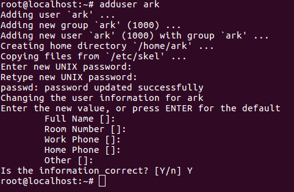
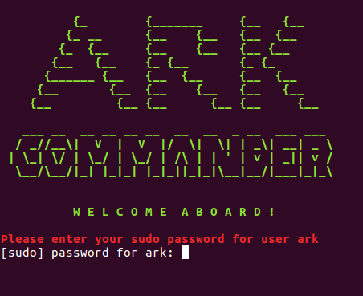
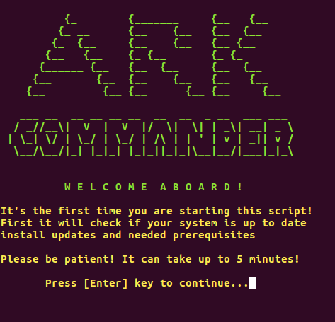
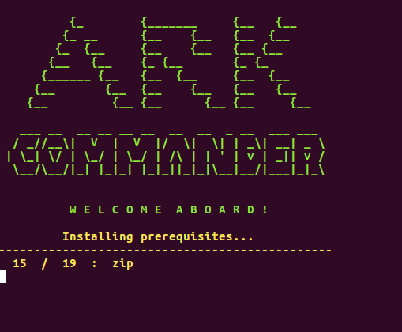
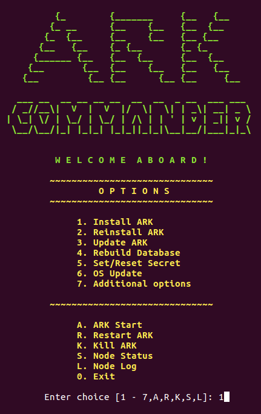
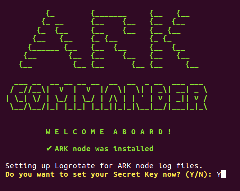
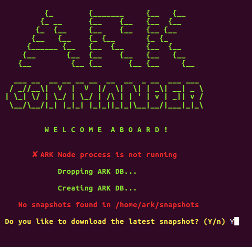

# How to Setup an Ark Node
Welcome, the purpose of this document is to help you setup a full ARK relay or delegate
node. This will guide you step by step and get you up and running relaying transactions
and securing the Ark Network.

## Minimum Requirements
**NOT SUITABLE FOR USE AS A DELEGATE NODE**
- 1 Dedicated CPU Core
- 4GB Ram
- Linux
- 20GB Free HD Space

## Recommended Specifications
- 2 CPU Cores+
- 8GB Ram+
- Ubuntu 16.04
- 40GB+ SSD

## Prerequisite Setup
### Create a Linux Server
We recommend using the cloud provider you are most comfortable with. Running an Ark Node
is not like Bitcoin mining and thus there are more options to choose from.
AWS, Linode, Digital Ocean, Vultr, Microsoft Azure, and OVH are just a few
recommended choices.

When choosing the size of VM please consider using a higher quality
server when running a delegate nodes. These nodes are the security of our network
and their uptime is of most importance in making sure the network runs smoothly.

The recommended specifications are what we would consider the minimum specifications
for delegate nodes. Smaller nodes are fine for relays or development purposes. We recommend using Ubuntu 16.04 however you are free to use any version of Linux you're comfortable with. These guides will use debian flavored Linux variants though.

With each provider, the setup process for creating a new virtual server is going to
be different. If choosing one of the listed providers, we have created quick
links below to quickly get started.

- [Linode](https://www.linode.com/docs/getting-started/#provision-your-linode)
- [Digital Ocean](https://www.digitalocean.com/community/tutorials/how-to-create-your-first-digitalocean-droplet)
- [AWS](https://docs.aws.amazon.com/AWSEC2/latest/UserGuide/get-set-up-for-amazon-ec2.html)
- [Vultr](https://www.vultr.com/)
- [Microsoft Azure](https://docs.microsoft.com/en-us/azure/virtual-machines/linux/overview)
- [OVH](https://support.ovhcloud.com/hc/en-us/articles/115001520890-Getting-Started-with-Servers)

### Connect to Your Server
After creating a server we need to connect to it. Your provider should have given you an
`ip address`, `username`, and `password` to connect to your new server.

This information can usually be found somewhere in your providers dashboard for your
new server.


Depending on your operating system you will connect to your server in different ways.
Window users will want to use something like [PuTTy](https://putty.org/).

#### Windows Users
Open PuTTy and place the `ip address` given to you by your provider in the
`Host Name` field as shown below. You should probably save this host so you don't
have to enter it every time.


#### MacOS / Linux
Open up a new terminal window and type in the following to connect to your new
server via `SSH`

```bash
ssh user@ipaddress
```

When first connecting to your new server you will be asked to cache the servers
host key and validate the rsa fingerprint, say or click yes.


When prompted use the password given to you by your cloud provider. Some providers
will require you to setup a a root password when creating the VM, while others may
give you a temporary password.


### Setup a User
Loging into our node and leaving root access open is not good security so we're going
to take care of that now.

On your server type the following into the command line and press enter. Where `username` is the name you want to login with:

```
adduser username
```

You will be prompted to enter in the users `full name` and some other information.
Feel free to just leave them all blank as they are optional. When prompted type `Y` and press enter.



### Giving our User Sudo Privileges

Next we need to make sure that our user can do all the things it needs to do. Type
the command below into your command line and press enter. Where `username` is the
name of the new account you created. This will give our user `sudo` privileges.

This will allow you to run programs with the security privileges of another user.
By default this is a `superuser`.

```
usermod -a -G sudo username
```

## Installing your ARK Node
We're now ready to begin installing ARK. The initial install may take awhile
and at times appear to not be doing anything. Please have patience and let the process
finish.

### Switch to the ARK user
While installing ARK, we should use the ARK user that we created above. To switch to it, run

```
sudo su - ark
```

### Update the system
To make sure that the Commander works on the first run we should update ubuntu to the latest available updates.
Execute the commands one after the other.

```
sudo apt-get update
sudo apt-get upgrade
sudo apt-get dist-upgrade
```

### Download ARK Commander

```
wget https://ark.io/ARKcommander.sh
```

### Make ARK Commander Executable
Next we need to make the file we just downloaded executable by our user.
```
chmod +x ARKcommander.sh
```

### Run ARK Commander
Now we'll run the file we just downloaded and begin our ARK Node installation.
```
./ARKcommander.sh
```
#### Sudo Password
ARK Commander is then going to ask you for your `sudo` password. This is
the password you used to login to the user account with. Enter your password
and press enter.



#### System Updates and Prerequisites
The first time you run ARK Commander it is going to update your system and make sure
you have the latest updates to required dependencies.





#### Reboot System
Once updates and prerequisites installation has finished reboot your system by
typing the following command and pressing enter.


```
sudo reboot
```

You will be disconnected from your server once again. Let's go ahead and reconnect
using our user we created.

```
ssh ark@ipaddress
```


### Run ARK Commander
After reconnecting to the server go ahead and run ARK Commander
```
./ARKcommander.sh
```

### Install ARK Node
Select option `1` to install ARK Node. Again, don't interrupt this process as it
will take a few minutes to install the required packages.



### Setting up a Delegate Node
After ARK Node installs you will be asked if you want to setup your secret key.
If you're just setting up a relay node, or not ready to setup your delegate node
at this time select `N`. Otherwise select `Y` and enter your delegate node secret
key now.



### Restoring your Database from a Snapshot
Letting the ARK blockchain download from peers can take a long time. We have
the ability to download a snapshot of the blockchain and import it right into our
database. Let's go ahead and do that now.

Select option `4` from the menu and press enter. When asked if you would like to
download the latest snapshot select `Y` and press enter.



Once the download finishes you will be asked if you would like to restore from
this snapshot. Select `Y` and press enter. If everything goes as planned you should
see the following once the restoration is complete. Press enter and return to the main menu.


### Checking to See if Everything is Working
If everything went as planned we should now be able to choose the `L` option
from the menu and see the transmission of block data across our node.

If you see `New block received` in your log congratulations, you now have a working
ARK node. If not, you may need to wait a couple minutes as the last few blocks sync that
were not in the latest snapshot.

If you need to go back and setup your delegate node you can do so by using option
`5` in the Main Menu.

## What's Next?
Great! you have a working node, but now you should really think about securing it.
It is especially important if you plan on using this as your delegate node.

In our next section we'll discuss making sure your ARK node is as secure as possible.
As the ARK network grows, hacking attempts on delegate and relay nodes will become
more prevalent. Defending against DDOS and other various attacks is extremely
important in securing the network.

----------------
[contributor information](./assets/info.md)