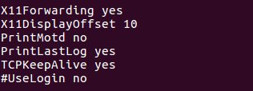
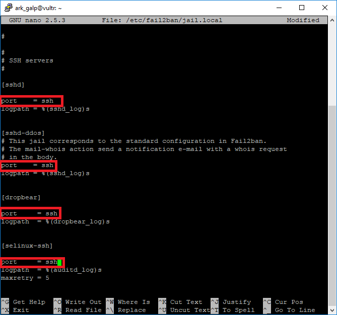
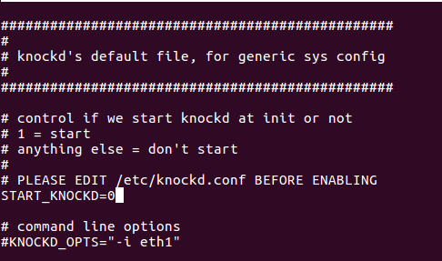
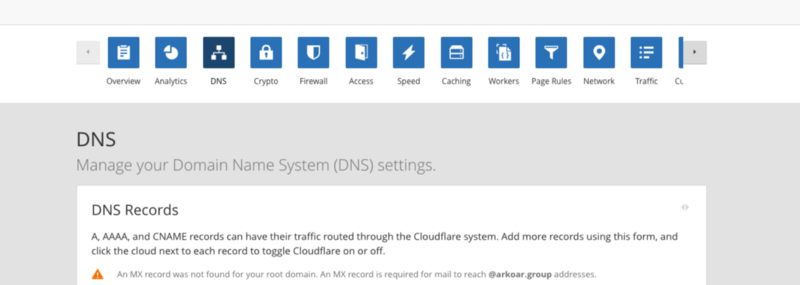

# Securing your ARK Nodes
When running an ARK node, especially a delegate node, you should have security
as first class citizen in your network. This guide will walk you through securing your nodes.
You could do more, but this is a good start. You will need to have created a user in our
previous guide [Setup Your ARK Node]() to follow along completely.

:warning:
**It is very important you follow this guide closely, not doing so could mean losing access to your node. If you lose access to your node there is no possible way for us to help you get it back. You will have to start over with a fresh server.**

## Security through Obscurity
By outlining how to secure a node we're breaking a fundamental property of network security. We're telling people how we're securing our network. This breaks the security through obscurity([Wikipedia Reference](https://en.wikipedia.org/wiki/Security_through_obscurity)) rule. In order to reintroduce some obscurity I'm going to ask you to make choices that you're going to need to remember on your own.

Write them down somewhere if you have to, but keep them secure and most importantly don't forget them, as we'll have no way of knowing what you chose.

## Making Sure Our Server is Updated
First thing we're going to do is make sure we have the latest security updates for Ubuntu. Once everything installs you'll need to reboot to make sure all the upgrades applied properly.

```
sudo apt-get update -y
sudo apt-get upgrade -y
```

:warning: **REBOOT YOUR SERVER** :warning:

```
sudo reboot
```

## SSH Security

### Edit your SSH config
Edit your `sshd_config` by running the following command
```
sudo nano /etc/ssh/sshd_config
```

#### Change default port


Change the `22` to a port of your choosing between `49152` and `65535`. This is the new SSH port we will connect on. Since we're not using the default SSH port, it's important you do not forget what you choose or you will not be able to access your server.

```
# What ports, IPs and protocols we listen for
Port 55555
```

#### Authentication Settings
In the previous section we had you create a new account for security purposes.
You should never login as root to your server after it has been setup. Our first security measure is going to be to disable root access all together.


Change `LoginGraceTime` to `60` and set `PermitRootLogin` to `no`

```
# Authentication:
LoginGraceTime 60
PermitRootLogin no
StrictModes yes
```

#### Disable X11 Forwarding
Set `X11Forwarding` to `no`



```
X11Forwarding no
```

#### Limit Max Concurrent Connections
Scroll down until you see the following line and remove the `#` to enable `MaxStartups`. Then set MaxStartups to `2`.


```
MaxStartups 2
```
#### Save your config file
Press `CTRL+X` to exit the file, `Y` to save the file and then `Enter` to write to the file and return to the command line.

#### Restart SSH daemon
```
sudo service ssh restart
exit
```

#### Test new SSH connection
```
ssh user@yournode -p 55555
```

If everything was setup successfully you should be reconnected to your ARK node. Replace `55555` with the port you chose when setting up your `sshd_config`

### Install Fail2Ban
#### What is Fail2Ban
The basic idea behind fail2ban is to monitor the logs of common services to spot patterns in authentication failures.

#### Installation 
Install Fail2Ban and create local configuration file.

```
sudo apt-get install fail2ban
sudo cp /etc/fail2ban/jail.conf /etc/fail2ban/jail.local
```

#### Configuration
Find all the references that specify port = SSH (typically in the SSH header section) and change the port to the new one you selected in the SSH security section above.

```
sudo nano /etc/fail2ban/jail.local
```



#### Save your config file
Press `CTRL+X` to exit the file, `Y` to save the file and then `Enter` to write to the file and return to the command line.

#### Restart Fail2Ban daemon
```
sudo service fail2ban restart
exit
```

### Port Knocking
#### What is Port Knocking?
Port knocking is a technique used which obscures the port you're actually connecting on to prevent port scanning by opening and closing it when you need it. We will use a series of ports to essentially "knock" and your server will open your configured port for you to connect on by listening for connection attempts on those ports in a specific order.

#### Disable UFW
By default UFW comes enabled with Ubuntu 16.04. If you get `ufw command not found` then run

```
sudo apt-get install ufw
sudo ufw disable
```

You can verify that UFW is disabled by running `sudo ufw status` and get a response of `inactive`.

#### Disable all incoming connections
```
sudo ufw default deny incoming
```

#### Enable Node Port
Depending which network this node is for will determine what port you open here. For mainnet use `4001`, devnet use `4002`, and testnet use `4000`.

We don't want to open any more ports than required to operate securely.

```
sudo ufw allow 4001/tcp
```

#### Install knockd on server
```
sudo apt-get install knockd -y
```

#### Start knockd server on boot
```
sudo nano /etc/default/knockd
```

We need to change `START_KNOCKD=0` to `START_KNOCKD=1`



```
################################################
#
# knockd's default file, for generic sys config
#
################################################

# control if we start knockd at init or not
# 1 = start
# anything else = don't start
#
# PLEASE EDIT /etc/knockd.conf BEFORE ENABLING
START_KNOCKD=1

# command line options
#KNOCKD_OPTS="-i eth1"

```

Then press `CTRL+S`, then answer `Y`, and finally press `ENTER` to return to the command line.

#### Edit Config
```
sudo nano /etc/knockd.conf
```
##### Knock Ports
Here we're going to pick our opening and closing knock sequence. Choose three ports between `7000` and `40000` for each opening and closing. Write these ports down. The sequences need to be different.

Modify your config file to match the one below with your own ports. We do not recommend just copying and pasting this config. Replace `7000`, `8000`, `9000` with your own choices.

Also don't forget to replace `55555` with the port you chose for `SSH`.

```
[options]
        UseSyslog

[openSSH]
        sequence    = 7000,8000,9000
        seq_timeout = 5
        command     = ufw allow 55555/tcp
        tcpflags    = syn

[closeSSH]
        sequence    = 9000,8000,7000
        seq_timeout = 5
        command     = ufw delete allow 55555/tcp
        tcpflags    = syn

```

#### Enable our Firewall and Start knockd
```
sudo service knockd start
sudo ufw enable
```

#### Status to make sure they're working
```
sudo service knockd status
sudo ufw status
```

#### Install knockd client
Install a client for your operating system to make knocking easier. There even a couple of mobile apps you can use for quickly knocking on your server to open your ssh port.

After knocking your port will remain open until you send the closing knock sequence.

##### Ubuntu 16.04
```
sudo apt-get install knockd
```

##### Alternate Clients
- [Win32 Client](http://www.zeroflux.org/proj/knock/files/knock-win32.zip)
- [MacOS Client](http://www.zeroflux.org/proj/knock/files/knock-macos.tar.gz)
- [Debian Package](http://packages.debian.org/unstable/net/knockd)
- [RPM Package](http://www.invoca.ch/pub/packages/knock/)
- [Android Client](https://play.google.com/store/apps/details?id=com.droidknocker)
- [iPhone Client](http://www.sungheroes.com/portknock/)

#### Troubleshooting and Testing
Logs for knockd appear in `syslog` and will be crucial if you need to troubleshot.

Run the following command on your ARK node server.
```
tail -f /var/log/syslog
```

Lets test our knocking! We set our SSH port, and we've enabled knocking. Now we need to test to make sure that when we send the correct knock that we open and close the port properly.

##### Open SSH Port
From your personal computer or mobile phone use the client you installed above or if you're running Linux install `knockd` by running `sudo apt-get install knockd` and use the following command to knock

```
knock -v nodeip 7000 8000 9000
```

You should see the following logs appear in your `syslog`
```
Apr 17 04:02:18 node1 knockd: nodeip: openSSH: Stage 1
Apr 17 04:02:18 node1 knockd: nodeip: openSSH: Stage 2
Apr 17 04:02:18 node1 knockd: nodeip: openSSH: Stage 3
Apr 17 04:02:18 node1 knockd: nodeip: openSSH: OPEN SESAME
Apr 17 04:02:18 node1 knockd: openSSH: running command: ufw allow 55555/tcp
```

Running `sudo ufw status` you should now see your SSH port enabled
```
arkoar@node1:~$ sudo ufw status
Status: active

To                         Action      From
--                         ------      ----
2086/tcp                   ALLOW       Anywhere                  
4002/tcp                   ALLOW       Anywhere                  
55555/tcp                  ALLOW       Anywhere                  
2086/tcp (v6)              ALLOW       Anywhere (v6)             
4002/tcp (v6)              ALLOW       Anywhere (v6)             
55555/tcp (v6)             ALLOW       Anywhere (v6)   
```

##### Close SSH Port
```
knock -v nodeip 9000 8000 7000
```

```
Apr 17 04:23:37 node1 knockd: nodeip: closeSSH: Stage 1
Apr 17 04:23:37 node1 knockd: nodeip: closeSSH: Stage 2
Apr 17 04:23:37 node1 knockd: nodeip: closeSSH: Stage 3
Apr 17 04:23:37 node1 knockd: nodeip: closeSSH: OPEN SESAME
Apr 17 04:23:37 node1 knockd: closeSSH: running command: ufw delete allow 55555/tcp
```

### Connect to SSH using Keys
:warning: **IF YOU DO NOT COPY THE CORRECT KEY TO YOUR SERVER IN THE CORRECT LOCATION YOU WILL LOSE ACCESS** :warning:

If you are not comfortable with this you can continue logging in via password, but it is less secure.

SSH keys should be generated on the computer you wish to log in from. Just press enter and accept all the defaults.

#### MacOS / Linux
```
ssh-keygen -t rsa
```

Browse to your `~/.ssh` directory and check to make sure it worked. You should see the following files.

```
cd ~/.ssh
ls -l

-rw------- 1 travism travism 1675 Mar 28 12:13 id_rsa
-rw-r--r-- 1 travism travism  401 Mar 28 12:13 id_rsa.pub
-rw-r--r-- 1 travism travism 3764 Apr 16 23:15 known_hosts
```

Copy your key to your server

```
# open SSH port it not already open
knock -v nodeip 7000 8000 9000

# copy key
ssh-copy-id -p 55555 user@nodeip
```

#### Windows
Windows users can generate their ssh key using [PuTTY Key Generator](https://www.ssh.com/ssh/putty/windows/puttygen)

##### Copy your **PUBLIC KEY** to your Server

Copy the contents of your `id_rsa.pub` file on your local machine to your `~/.ssh/authorized_keys` on your ARK node server.

#### Disable Password Authentication
```
sudo nano /etc/ssh/sshd_config
```

This file should look familiar to you as we edited it earlier in this process. This time we're going to disable password authentication. Set
`PasswordAuthentication` to `no` and make sure that `PubkeyAuthentication` is set to `yes` and `ChallengeResponseAuthentication` is set to `no`

```
PasswordAuthentication no
PubkeyAuthentication yes
ChallengeResponseAuthentication no
```

Save your changes by pressing `CTRL+X`, then respond with `Y`, and finally press `ENTER` to write to file.

#### Restart SSH
```
sudo service ssh restart
```

The next time you login you should just log right in without a password prompt.


### DDOS Protection with Cloudflare
In this section we're going to setup Cloudflare and SSL for ddos protection and security using Nginx as a reverse proxy.

#### Install Nginx
```
sudo apt-get install nginx
```

#### Edit Nginx Config
```
sudo nano /etc/nginx/enabled-sites/default
```

Paste in the following config, making sure you edit the `server_name` and `proxy_pass`. You may need to change `ssl_certificate` and `ssl_certificate_key`
if you name your files something different.

```
# HTTPS
server {
  listen 443;
  server_name node.yoursite.com;
ssl on;
  ssl_certificate /etc/nginx/ssl/ark.crt;
  ssl_certificate_key /etc/nginx/ssl/ark.key;
  ssl_verify_client off;
  ssl_protocols TLSv1 TLSv1.1 TLSv1.2;
  ssl_ciphers EECDH+CHACHA20:EECDH+AES128:RSA+AES128:EECDH+AES256:RSA+AES256:EECDH+3DES:RSA+3DES:!MD5;
  ssl_prefer_server_ciphers on;
location / {
    proxy_set_header X-Real-IP $remote_addr;
    proxy_set_header X-Forwarded-For $proxy_add_x_forwarded_for;
    proxy_set_header X-NginX-Proxy true;
    proxy_pass http://localhost:4001/;
    proxy_ssl_session_reuse off;
    proxy_set_header Host $http_host;
    proxy_cache_bypass $http_upgrade;
    proxy_redirect off;
  }
}
```

Press `CTRL+X` to exit the file, `Y` to save the file, and `ENTER` to write to the file and return to command line.

#### Cloudflare / SSL Setup

##### Login to your Cloudflare dashboard and click on the `DNS` button.


##### Click Crypto


##### Create Origin Certificate
Scroll down to `Origin Certificates` and click the `Create Certificate` button. Keep this window open after Cloudflare generates your two keys.


##### Open Terminal on your ARK Node Server
We need to create a new folder and copy our keys to our server.

```
mkdir /etc/nginx/ssl
cd /etc/nginx/ssl
touch ark.crt ark.key
```

Copy the `PRIVATE KEY` to the file `ark.key` and the `CERTIFICATE` to `ark.crt`.

##### Start Nginx
```
sudo service nginx start
```

If everything started fine you should be able to now access your ARK node API's
behind SSL. Giving you the added bonus of cloudflare DDOS protection.

Otherwise, if you get any errors run the following command to troubleshoot nginx.
```
sudo nginx -t -c /etc/nginx/nginx.conf
```

### Conclusion
Your node is now very secure. With this setup you can open and close your SSH port
remotely using a secret knocking technique as well as sign in using cryptographic
keys.

----------------
[contributor information](./assets/info.md)