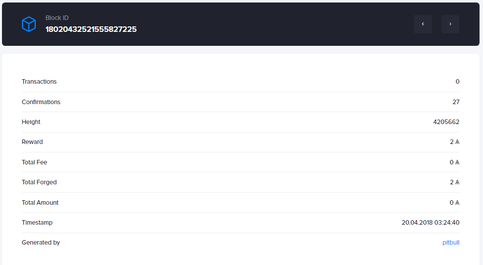
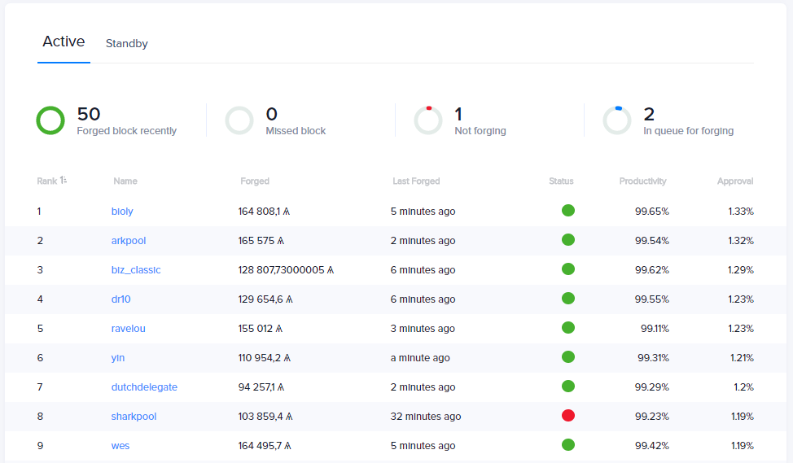
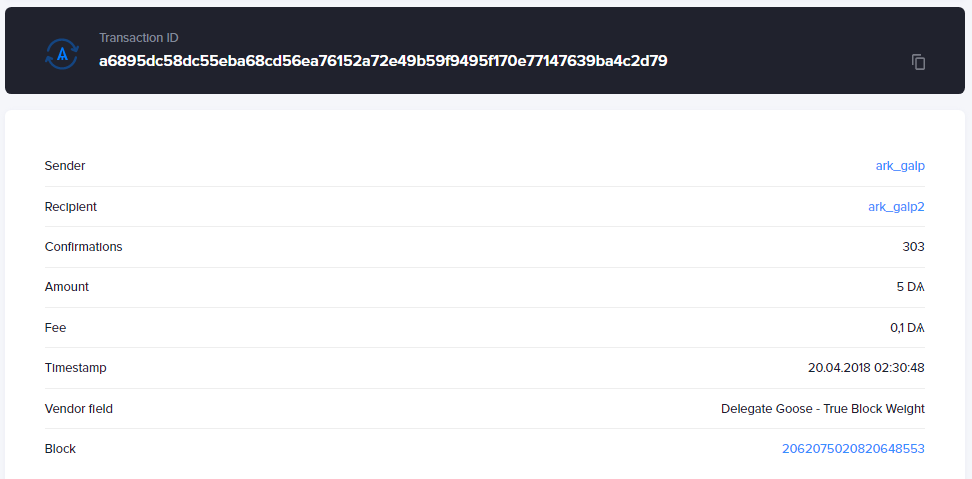

#### What is an "Account"?
An account is, in most cases, a pair of private and public keys, it provides a simple addressing format for the network to track transaction senders and recipients.

The private key can be replaced by a passphrase, also called a secret. The public key is derived from the private key and is translated to a more readable, shorter format called address. Many addresses can refer to the same public key.

Funds are messages signed and sent from the owner of the account, with the private key or counterpart. The payment message is addressed to the account public key of the recipient through one of its derived addresses.

With the use of cryptography, the data necessary to authorize an outgoing payment cannot be derived from the publicly available data, making the application secure for distributed ledgers.

> AYavRHU9KSeCUSRk8Qe9ZZG2gr9sG6fNzx

#### What is a "Block"?
A block is a collection of transactions that holds part of the ledger history. It goes through the gathering, validating and acceptance phases.

Gathering refers to peers in the network sharin newly sent transactions with each other to create a transaction pool. In some cases, there is a smaller number of peers responsible for the creating of the block, in others anyone with access to new transactions can potentially participating in creating a block.

Validating, or creating, a block is the act of confirming that the transactions which amount to the block satisfy certain network requirements. This is to prevent Byzantine - malpractice or unresponsiveness - errors. 

It is in the best interest of the validating peer to push for blocks which don't contain malicious transactions, because the chain in which the block is contained has the potential to not be accepted by good peers and the reward for validating the block will not be granted in the prevailing version of the Blockchain.

> 

#### What is a "Delegate"?
A delegate is a peer that is supported by other users and responsible for the gathering, validation and forging of blocks from transactions.

The owners of a resource valuable to the network (identity, coins, energy) are tasked with appointing those resources to a peer they delegate to take important network actions.

In a delegated Blockchain, the selected peers are in charge of most aspects in the maintenance of the ledger. The incentive to act poorly is reduced, the paid position can be lost by the delegate every delegation cycle.

Every delegated peer gets a chance to participate in creating blocks either on a turn basis or for every block.

> 

#### What is a "Loader"?
A Loader provides the synchronisation and loading information of a client. 

The loader's job is querying peers' blockchains to construct the history locally. It is required to ensure that a peer has relevant records of the network's transactions to enable a correct display of actualized data. The loader plays a key part in the exploration and creation of transactions in the blockchain.

#### What is a "Peer"?
A peer is connected to the distributed network and propagates data.

Peers contribute to increasing the network speed by maintaining connections to create routes. Peers also perform basic validation checks to ensure the data they forward or receive isn't in contradiction with their version of the blockchain. A peer is functional once it has retrieved the required data to execute a task. To validate a transaction and broadcast it, a peer needs to hold the latest balance for the account.

#### What is a "Node"?
A node is a functional participant in the distributed network. 

The node's job is to ensure the readiness of the blockchain to reduce the connections needed between its peers to retrieve block or transaction information. Nodes keep track of the blockchain and are crucial in ensuring the network's cohersion. Nodes serve as servers and are connected to many other peers.

#### What is a "Signature"?
A signature is a cryptographic way to prove the provenance of a message or transaction.

The message is input into an algorithm alongside the private key, generating a cryptographic hash that can be decoded into the original message and proven to have come from the account holder. Signatures are useful to ensure the authenticity of a spending operation's provenance.

#### What is a "MultiSignature"?
A multisignature is a cryptographic way to prove that a message or transaction comes from a minimum number of possible accounts. 

Parties add their signature to the message one by one and the underlying transaction is processed only once a specified number of signatures from the designated accounts can be confirmed. Multisignatures are separations of control over given transactions. The multisignature transactions act much like accounts do, only there are multiple keys that represent valid cosigners.

#### What is a "Transaction"?
The signed transfer of value from one account to another. 

A transaction contains the amount to send, the sender of the funds and the receiver's public address. It is a small message that is only allowed to transfer value from one account to another if it can be proven to have been signed by the private key of the sending account.

> 

#### What is a "Transport"?
A Transport happens to data as it flows through the network from peer to peer. 

It is the interface that enables the formatted transfer of transactions from one peer to another. It is important to have a transport protocol that supports standardized communication between peers to reduce the overhead from converting or decyphering transaction information.

<pre>
        resp = transport.post_transaction(
        "dark", # Network
        "DDvQqwqPXKd5P8dLAroFsnKR5Q3tKUtvnp", # RecipientAddress
        1000000, # Amount
        "firstPassphrase", # First passphrase, mandatory
        "vendorField", # Vendor field, optionnal
        "secondPassphrase") # Second passphrase, optionnal
</pre>

#### What is a "Dark Address"?
A Dark address is on the Development Network of Ark and holds the DARK currency. 

Dark addresses aren't compatible with Ark addresses, as the latter are used on the Main Network of the ecosystem. The DevNet is the testing grounds, it is used to test applications wanting to run on the Ark network or upgrades to the Main Network.

> DS2YQzkSCW1wbTjbfFGVPzmgUe1tNFQstN

#### What is a "Reward"?
A reward is attributed to the block forger for its validation efforts. 

A determined amount is allocated to each block and the reward takes the form of a new transaction originating from the block or from fees taken from the block's transactions. Rewards incentivise the delegated forgers to act properly, as a block rejected by peers means the delegate won't receive a payment.

#### What is a "Fee"?
A fee is taken from the transaction and added to the reward. 

Delegates can choose which transactions to include  based on the fee the sender is willing to pay to have the transaction be added to a block. Fees are important to prevent spamming on the network; spam clogs the channels and slows transaction speed.

#### What is a "Height"?
The height is the block number or specific location in the blockchain. 

It is important when referring to a transaction's point on the timeline or when important events are scheduled based on block height. The height is a number starting close to 0 and gradually increasing to an infinite number with every addition to the blockchain.

#### What is a "Forged"?
A forged block is created by a delegate. 

The forged block contains transactions selected at the delegate's discretion. Forging is a responsibility given to delegates on a turn basis. Once a block is forged and distributed to nodes, the following forged blocks are said to be in agreement with the previous ones.

#### What is a "Block missed"?
A block missed wasn't forged by the approved delegate on time. 

Every delegate has to produce a valid forged block in a strict time window to ensure a high transaction throughput within the network. Missing a block takes a proportional chunk out of the network's expected linear efficiency.

#### What is an "Approval"?
Approval is granted to a delegate with enough votes and gives it forging power. 

Approval enables the node to execute delegate functionalities like forging blocks. Approval is necessary and can be revoked once every delegation cycle. It is important for delegates to maintain approval, or they could lose their role and the benefits that come with it.

#### What is a "Vote"?
A vote is the weighing of the voting power towards a delegate of an account with funds. 

A voter splits his vote between delegates of his choice. The voter doesn't need to spend his funds, they are a reflection of the voter's stake in the network economy.

#### What is a "Voter"?
A voter holds the power to elect a delegate with his account. 

A voter decides where his vote(s) are placed for every delegation cycle and can change them often. Placing a vote is like making a transaction, though it costs a higher fee and has different network implications than a simple value transfer. The voter is incentivized to take a strong position in the placement of its vote.
